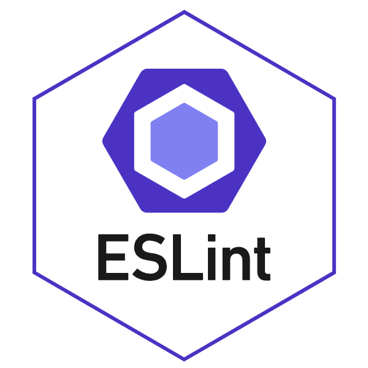

## New is Always Better
  Since venturing into programming my freshmen year of college, Iʻve always used vim or VS Code as my go to IDE but since switching to ES Lint and IntelliJ, everything is so much cleaner and just better overall. I think my favorite thing about this is that it tells you the errors in your code as you're still working on the program. IntelliJ is a very user-friendly program thats way more visually pleasing than VS Code or VIM and being able to run your program directly to Google Chrome is a new feature that I donʻt necessarily like but it is definitely a cool feature. Iniitially I had a lot of trouble trying to install IntelliJ. Te first time I downloaded it, it wouldnʻt open no matter how many times I clicked on it so I deleted everything and startd over. The second time, the command "npm install" was not working so I decided to start over one more time. Finally on the third download everything started working. From there on I liked IntelliJ and ES Lint a lot. 
  
## Becoming More Familiar
  Being someone who struggles coding already, IntelliJ and ES Lint has helped me understand things a little bit more. Although I do need to practice more and get more comfortable with IntelliJ and ES Lint I wish this would've been introduced in an earlier class. Looking back, if I had learned about this sooner maybe I wouldn't be struggling as much as I am now. Moving forward I think that I'll be able to get more comfortable with using this IDE and hopefully it will help me grow more as an engineer. Using ES Lint makes coding a little more tedious but I know that in the end it will make me a better programmer so I'm willing to brave the storm ahead.
