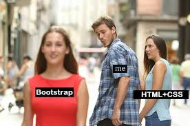

## Changing web design since 2021

Prior to this class I had very little experience designing websites or even using HTML. A lot of this, especially using Bootstrap 5 was extremely new to me. Compared to other languages this one is easier for me to understand but it is a lot more tedious to get things how you want it to look. Considering I eventually want to move into web design and app development, this is probably something I truly have to master. 

## Since using UI Frameworks

The past couple weeks since weʻve been using HTML in class I think that Iʻve made some pretty great progress. As overwhelming as this class can be, it's one of the few where I feel like I'm actually learning things to apply to my future career. Using HTML alone was harder than being able to add CSS styling and Bootstrap 5. In the images below you can see that I'm now able to recreate website designs (even though it's not perfect) and it truly has given me confidence to learn more and refine my programming skills. 

  

  
  

  

There are still a lot of things I need to learn to make my websites look a lot better than they currently do, but I'm content with where I'm at right now.

## Conclusion

Learning web development has been a frustrating yet rewarding journey. It's crazy to think that every website you see is as simple as what we've learned with just a few more things to make them more user friendly. I'm looking forward to what else I'll learn not only in this class but outside to make me a better programmer.

