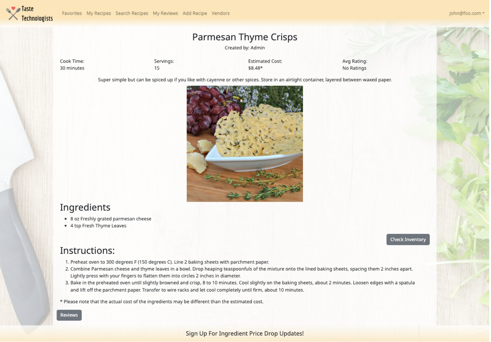

[Taste Technologists](https://taste-technologists.github.io/) is a website created for a final project for a software engineering course at University of Hawaiʻi at Mānoa. The motivation behind this app was for busy college students who need 
quick and cheap recipes to make throughout the week keeping in mind that they might only have basic kitchen appliances. Users are able to add recipes and edit them, favorite recipes they may want to come back to later and filter recipes based on 
dietary restrictions or what type of meal they're looking for (breakfast, lunch, dinner or snack). We also decided to implement a vendor role for stores within walking distance of campus so when users create a recipe and add all the ingredients 
needed the website automatically calculates an estimated cost per serving to make the recipe as shown in the sample recipe card below. 

  

We used issue driven management which allowed each of us to pick tasks that still needed to be completed once we finished our previous ones. For this project, I created the landing page, sign in page, an edit recipe form, and ran testcafe tests 
on some pages already developed along with some backend tasks. This project helped me understand what it's like to work in a software engineering specific group project while also improving and refining my own skills in meteor and react. Going 
into this class I didn't imagine I'd be able to be part of developing an actual website but after this project and the help of my group, this gives me a lot more confidence going into my last semester before entering the work force. 